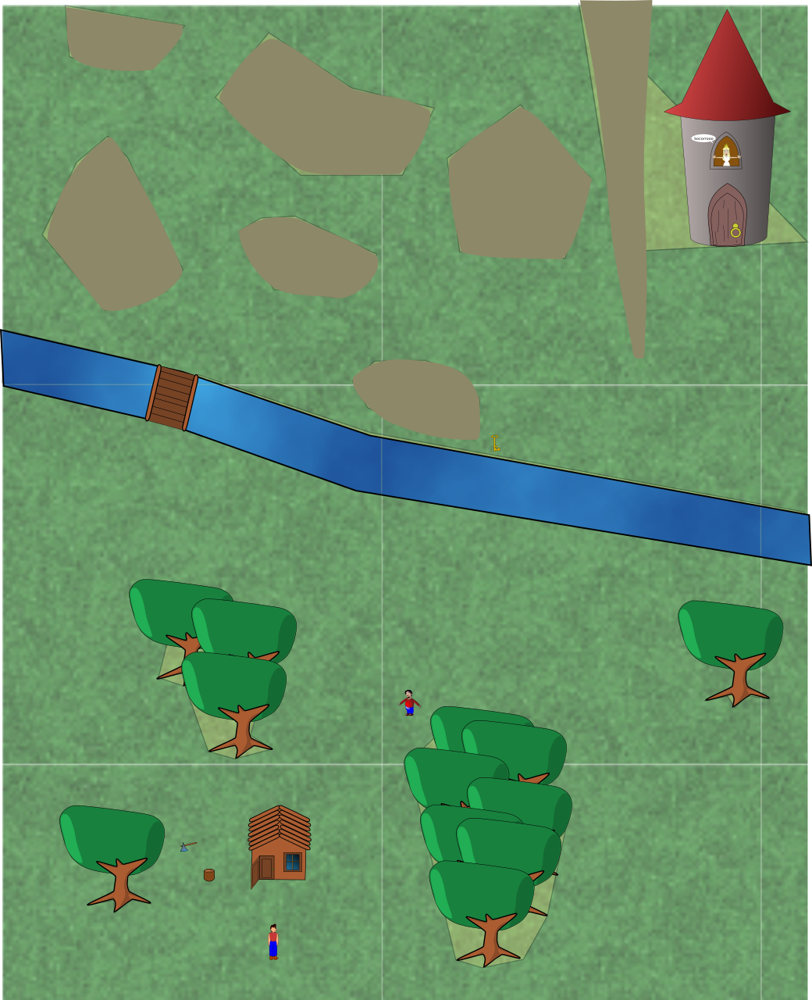

# SVGjs-game-engine
Javascript game engine with SVG graphics

This is another upload in the *nostalgia* category, because it does not work anymore.

I was curious of what it would take to do this, so I decided to try. This was before HTML canvas came out and git was a thing.

 - Character animations: sprites or moving body parts (as SVG groups)
 - Complex movements: accelerated, linear, chasing, avoiding.
 - Group movement (like Warcraft) and route planning.
 - Physics: advanced collision detection
 - Physics: elastic and inelastic collisions of non-point objects
 - Free camera or chasing
 - Behaviours for PNJs
 - Group behaviours
 - Tree like conversations
 - Inventory, items, action
 - Controllable with keys or mouse. "Warcraft" group mode.

The default camera mode was zoomed in and scroll following the character,

This is a zoomout of the whole test-map, where you can see the poligons for collision detection (invisible in-game).

I got bored when I had to make an actual game with it :D

It was working fine around the time of FF 3. It does not work anymore.
